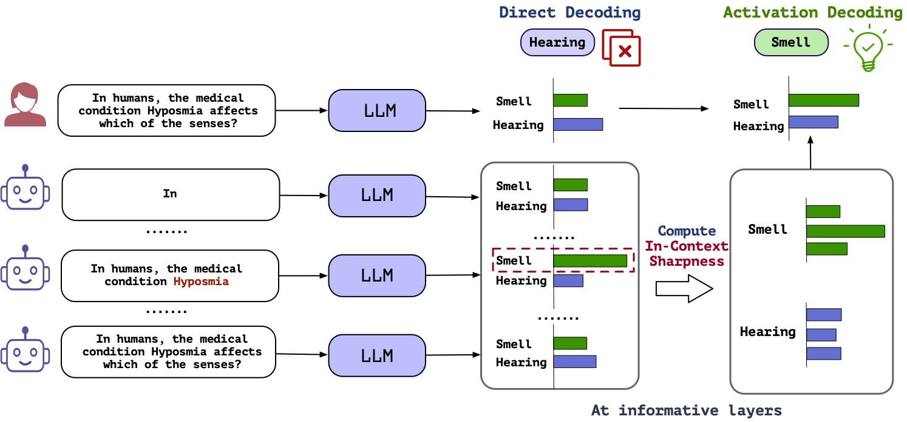

Activation_Decoding: Decoding by sharpness inside Large Language Models
=======================================================================

## Overview



This is the code implementation of the paper: [In-Context Sharpness as Alerts: An Inner Representation Perspective for Hallucination Mitigation
](https://github.com/hkust-nlp/Activation_decoding)

We discover a pattern associated with hallucinations: correct generations tend to have *sharper* context activations in the hidden states of the in-context tokens, compared to that of the incorrect generations. Leveraging this signal, we propose an entropy-based metric to quantify the "*sharpness* " among the in-context hidden states and incorporate it into the decoding process, i.e, use the entropy value to adjust the next token prediction distribution to improve the factuality and overall quality of the generated text.

## Setup

```

conda create --name decode python=3.8
conda activate decode
pip install -e transformers
pip install -r requirements.txt
```

## Experiments

### Arguments

| Argument          | Example           | Description   |
| ----------------- | ----------------- | ------------- |
| `--model-name`    | `daryl149/Llama-2-7b-chat-hf` | Specifies the model you want to use, currently we support LLaMA all versions. |
| `--data-path`     | `/path/to/dataset` | Path to the dataset file or folder. |
| `--dataset-name`     | `hotpotqa` | The dataset for evaluation. Can choose from `"natural_questions" or "triviaqa"` |
| `--decoding_mode`      |``activation`` | Choose the decoding mode. Can choose from  `"baseline", "dola", "activation","activation_dola"` |
| `--decoding_strategy`      |`entropy` | Add this when the `"decoding_mode"` is `activation`or `activation_dola`.  Can choose from  `"entropy", "single_entropy"` |
| `--alpha`      |`0.5`| Control the magnitude of activation. For OOD test, we use `0.5/0.8/1.0` for `7B/13B/70B` models. |
| `--info_layer`      |`26`| The index of layer we use to calculate the entropy. For OOD test, we use `26/34/70` for `7B/13B/70B` models. |
| `--output-path`   | ``../res/res_hpqa/${model_name}/${decoding_mode}.json`` | Where to store the output results. |
| `--num-gpus`      | `1` | Number of GPUs to use, `1/1/2` for `7B/13B/70B` model sizes respectively if you are using 80G GPU cards.  |
| `--do-rating`      | | Add this to output evaluation results  |

#### In-domain Hyperparameter choice

In the table below, we present the `alpha` with the `info_layer` choices for each knowledge-seeking dataset, formatted as `alpha/info_layer`.

| | TriviaQA | HotpotQA | NQ |
|---| --- | --- | --- |
|`LLaMa2-7B-chat`| `1/32`| `0.8/32` |`0.2/32`  |
|`LLaMa2-13B-chat`| `0.6/32` |`1/28`  |  `0.8/34`|
|`LLaMa2-70B-chat`|  `1/70`| `0.6/66` | `1/68` |

### TriviaQA, HotpotQA and Natural Questions

```bash
cd scripts
bash run_qa.sh # refer to this script for more details
```

### TruthfulQA

#### Multi Choice

```bash
cd scripts
bash run_mctqa.sh # refer to this script for more details
```

#### Open generation

To evaluate the open-ended generation result of TruthfulQA, we need to finetune two GPT-3 curie models through OpenAI API:

```
openai api fine_tunes.create -t finetune_truth.jsonl -m curie --n_epochs 5 --batch_size 21 --learning_rate_multiplier 0.1
openai api fine_tunes.create -t finetune_info.jsonl -m curie --n_epochs 5 --batch_size 21 --learning_rate_multiplier 0.1
```

After finetuning, we can obtain the finetuned model names by `openai api fine_tunes.list | grep fine_tuned_model`.

Create a config file `gpt3.config.json` like this:

```json
{"gpt_info": "curie:ft-xxxxxxxxxx",
"gpt_truth": "curie:ft-xxxxxxxxxx",
"api_key": "xxxxxxx"}
```

Add the argument ` --gpt3-config gpt3.config.json` for GPT-3 evaluation.

```bash
cd scripts
bash run_tqa.sh # refer to this script for more details
```

## Reference Repositories

- Dola: https://github.com/voidism/DoLa

## Citation

Please cite our paper if it's helpful to your work!

```

```

```

```
